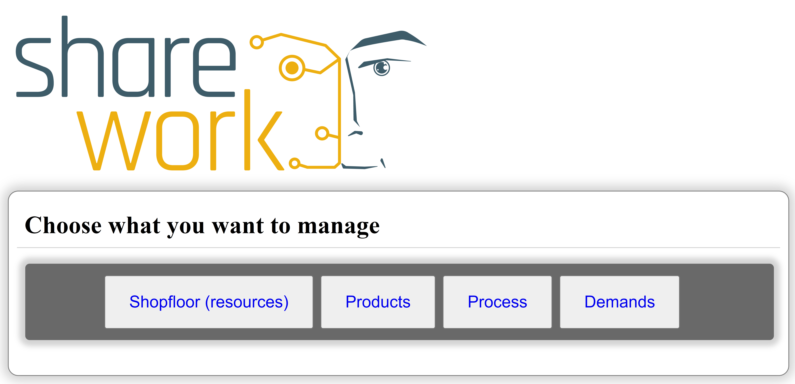

<a name="readme-top"></a>

<br />
<div align="center">
  <a href="https://github.com/othneildrew/Best-README-Template">
    
  </a>

  <h3 align="center">TENANT - Tool fostEriNg Ai plaNning in roboTics Stand-Alone</h3>
</div>

<details>
  <summary>Table of Contents</summary>
  <ol>
    <li>
      <a href="#about-the-project">About The Project</a>
      <ul>
        <li><a href="#built-with">Built With</a></li>
      </ul>
    </li>
    <li>
      <a href="#getting-started">Getting Started</a>
      <ul>
        <li><a href="#prerequisites">Prerequisites</a></li>
        <li><a href="#installation-and-run">Installation and Run</a></li>
      </ul>
    </li>
    <li>
      <a href="#gallery">Images</a>
    </li>
    <li>
      <a href="#roadmap">Roadmap</a>
    </li>
  </ol>
</details>

## About The Project



Tool fostEriNg Ai plaNning in roboTics Stand-Alone (__TENANT__) is a general purpose software tool that can be deployed for addressing multiple applications/domains and can be easily integrated with other knowledge engineering tools such as, e.g., ROS-TiPlEx and Planning and Scheduling software framework, e.g., [PLATINUm](https://github.com/pstlab/PLATINUm).

### Built With

[![Python][Python-shield]][Python-url] [![Flask][Flask-shield]][Flask-url] [![Jinja][Jinja-shield]][Jinja-url] [![JQuery][JQuery.com]][JQuery-url] [![SQLite][SQLite-shield]][SQLite-url]

<p align="right">(<a href="#readme-top">back to top</a>)</p>

## Getting Started

__TENANT__ is a software that allows you to **simplify** the following operations:

* Defining a collaborative process in terms of tasks, operational requirements and possible assignments (some tasks should be performed by the human only, some by the robot only and some by both); 
* Creating a planning model template for the task planning specification to model generic tasks and operational requirements as an abstraction of task planning (e.g., a set of state variables and temporal constraints);
* Instantiates the template of the task planning specification into a concrete planning model according to the described process.

### Prerequisites

* A linux distribution (**Ubuntu 18.04** has been used for running and testing the software)
* [Python 3](https://python.org) and pip
* [Virtualenv](https://virtualenv.pypa.io/en/latest/) (**not required but recommended**)

### Installation and Run

In order to run the software, follow the instructions below

1. Clone the repo and move into the folder
   ```sh
   git clone https://github.com/pstlab/TENANT_sa.git
   cd ./TENANT_sa
   ```
2. Create a virtual environment with virtualenv and activate it (**only if you want use virtualenv**)
   ```sh
   python -m pip install virtualenv
   python -m venv env
   source ./env/bin/activate
   ```
   * To **deactivate** the virtual environment use the command `deactivate`
3. Install the requirements contained in `requirements.txt`
   ```sh
   python -m pip install -r ./requirements.txt
   ```
4. Init the database and run the server
   ```
   python ./init_db.py
   python ./run.py
   ```
A local server will be started at `http://127.0.0.1:5000/`.
Open to the following address with any browser to use the software.

<p align="right">(<a href="#readme-top">back to top</a>)</p>

## Gallery

</img> </img> </img> </img> </img> </img> </img> 

<p align="right">(<a href="#readme-top">back to top</a>)</p>

## Roadmap

- [ ] Aggiungere cose alla roadmap :P

<p align="right">(<a href="#readme-top">back to top</a>)</p>

<!-- MARKDOWN LINKS & IMAGES -->
[SQLite-shield]: https://img.shields.io/badge/sqlite-%2307405e.svg?style=for-the-badge&logo=sqlite&logoColor=white
[SQLite-url]: https://www.sqlite.org/
[Flask-shield]: https://img.shields.io/badge/Flask-000000?style=for-the-badge&logo=flask&logoColor=white
[Flask-url]: https://flask.palletsprojects.com/en/2.2.x/
[Jinja-shield]: https://camo.githubusercontent.com/bf9a5122ae18817a5a34fad613bde9d31a53e1589ae8f960003c13136c59ff96/68747470733a2f2f696d672e736869656c64732e696f2f7374617469632f76313f7374796c653d666f722d7468652d6261646765266d6573736167653d4a696e6a6126636f6c6f723d423431373137266c6f676f3d4a696e6a61266c6f676f436f6c6f723d464646464646266c6162656c3d
[Jinja-url]: https://jinja.palletsprojects.com/en/3.1.x/
[Python-shield]: https://img.shields.io/badge/Python-3776AB?style=for-the-badge&logo=python&logoColor=white
[Python-url]: https://python.org
[JQuery.com]: https://img.shields.io/badge/jQuery-0769AD?style=for-the-badge&logo=jquery&logoColor=white
[JQuery-url]: https://jquery.com
